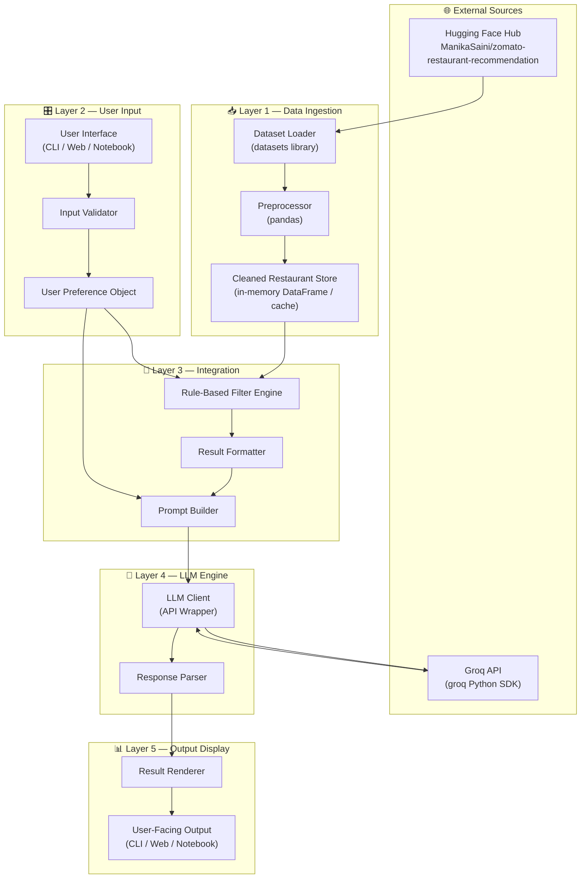
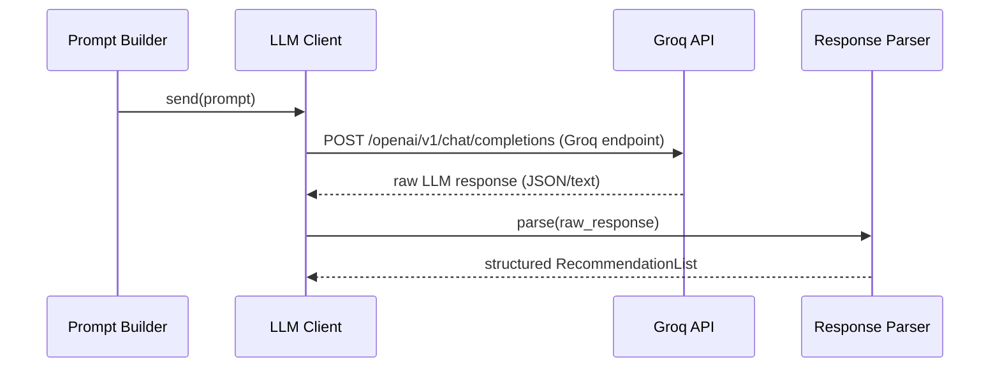
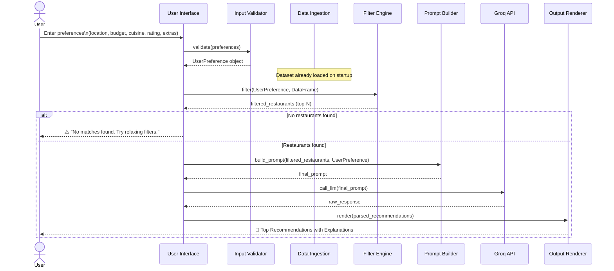

# Architecture: AI-Powered Restaurant Recommendation System (Zomato Use Case)

> **Version:** 1.0  
> **Last Updated:** 2026-06-20  
> **Reference:** [context.md](./context.md) | [problemStatement.txt](./problemStatement.txt)

---

## Table of Contents

1. [System Overview](#1-system-overview)
2. [High-Level Architecture](#2-high-level-architecture)
3. [Component Breakdown](#3-component-breakdown)
   - [3.1 Data Ingestion & Preprocessing Layer](#31-data-ingestion--preprocessing-layer)
   - [3.2 User Input Layer](#32-user-input-layer)
   - [3.3 Integration & Filtering Layer](#33-integration--filtering-layer)
   - [3.4 LLM Recommendation Engine](#34-llm-recommendation-engine)
   - [3.5 Output Display Layer](#35-output-display-layer)
4. [Data Flow Diagram](#4-data-flow-diagram)
5. [Sequence Diagram](#5-sequence-diagram)
6. [Data Model](#6-data-model)
7. [Technology Stack](#7-technology-stack)
8. [Module Structure (Proposed Codebase)](#8-module-structure-proposed-codebase)
9. [Prompt Engineering Design](#9-prompt-engineering-design)
10. [Error Handling & Edge Cases](#10-error-handling--edge-cases)
11. [Scalability & Extensibility](#11-scalability--extensibility)
12. [Security Considerations](#12-security-considerations)
13. [Non-Functional Requirements](#13-non-functional-requirements)
14. [Decision Log](#14-decision-log)

---

## 1. System Overview

The **AI-Powered Restaurant Recommendation System** is a 5-stage intelligent pipeline that combines:

- **Rule-based filtering** — to narrow down restaurants from a real-world dataset based on hard user constraints (location, budget, cuisine, rating).
- **LLM reasoning** — to rank filtered restaurants, generate natural-language explanations, and personalize results beyond what simple filters can achieve.

The system targets users seeking context-aware dining suggestions with human-like reasoning, rather than generic database query results.

```
Input: User Preferences  ──►  Data + LLM Pipeline  ──►  Output: Ranked Restaurant Recommendations
```

---

## 2. High-Level Architecture



---

## 3. Component Breakdown

### 3.1 Data Ingestion & Preprocessing Layer

**Purpose:** Load the raw Zomato dataset from Hugging Face and produce a clean, queryable in-memory store.

| Sub-Component | Responsibility |
|---------------|----------------|
| **Dataset Loader** | Uses the HuggingFace `datasets` library to pull the `ManikaSaini/zomato-restaurant-recommendation` dataset |
| **Preprocessor** | Cleans raw data using `pandas`: drops nulls, normalizes text fields (lowercase cuisine/location), maps cost to budget tiers |
| **Cleaned Restaurant Store** | Stores the final DataFrame in memory (or optionally caches to disk) for fast querying during the session |

**Key Preprocessing Steps:**

```
Raw Dataset
  │
  ├─► Drop rows with missing critical fields (name, location, cuisine, cost, rating)
  ├─► Normalize text: strip whitespace, lowercase location & cuisine strings
  ├─► Map cost-for-two values → Budget tiers: Low | Medium | High
  ├─► Validate rating range: keep only entries where 1.0 ≤ rating ≤ 5.0
  └─► Output: Clean pandas DataFrame (indexed, ready for filtering)
```

**Inputs:** Raw dataset from Hugging Face Hub  
**Outputs:** Clean pandas DataFrame with standardized columns

---

### 3.2 User Input Layer

**Purpose:** Collect, validate, and structure user preferences into a well-typed input object.

| Preference Field | Type | Required | Example Values |
|-----------------|------|----------|----------------|
| `location` | `str` | ✅ Yes | `"Delhi"`, `"Bangalore"`, `"Mumbai"` |
| `budget` | `enum` | ✅ Yes | `"low"`, `"medium"`, `"high"` |
| `cuisine` | `str` | ✅ Yes | `"Italian"`, `"Chinese"`, `"North Indian"` |
| `min_rating` | `float` | ✅ Yes | `3.5`, `4.0`, `4.5` |
| `additional_prefs` | `str` | ❌ Optional | `"family-friendly"`, `"rooftop seating"` |

**Validation Rules:**
- `location` must be a non-empty string; warn if no dataset matches are found after filtering
- `budget` must be one of the three defined tiers (case-insensitive)
- `min_rating` must be a float in range `[1.0, 5.0]`
- `additional_prefs` is free-form text passed verbatim to the LLM prompt

**Output:** A `UserPreference` object (dataclass / dict) passed to the Integration Layer.

---

### 3.3 Integration & Filtering Layer

**Purpose:** Act as the bridge between structured data and the LLM. Apply hard filters first, then construct an optimal prompt.

#### 3.3.1 Rule-Based Filter Engine

Applies sequential AND-filters to the cleaned DataFrame:

```
Cleaned DataFrame
  │
  ├─► Filter 1: location CONTAINS user.location (case-insensitive)
  ├─► Filter 2: cuisine CONTAINS user.cuisine    (case-insensitive)
  ├─► Filter 3: budget_tier == user.budget
  ├─► Filter 4: rating >= user.min_rating
  └─► Output: Filtered DataFrame (top-N candidates, e.g. N=10–20)
```

> **Note:** Filters are applied in descending selectivity order to reduce computational overhead. If fewer than 3 results remain, the system may relax lower-priority filters (e.g., cuisine) and notify the user.

#### 3.3.2 Result Formatter

Converts the filtered DataFrame rows into a structured text block for LLM consumption:

```
Restaurant 1:
  Name: Spice Garden
  Cuisine: North Indian
  Location: Delhi, Connaught Place
  Rating: 4.3 / 5.0
  Estimated Cost (for 2): ₹800 (Medium budget)

Restaurant 2:
  ...
```

#### 3.3.3 Prompt Builder

Assembles the full LLM prompt by combining:
- **System instruction** — Role, task, and output format definition
- **Formatted restaurant list** — From the Result Formatter
- **User preferences** — Including the optional free-form additional preferences

See [Section 9 — Prompt Engineering Design](#9-prompt-engineering-design) for the full prompt template.

---

### 3.4 LLM Recommendation Engine

**Purpose:** Use an LLM API to rank and explain restaurant recommendations based on the constructed prompt.



**LLM Client Responsibilities:**
- Calls the **Groq API** via the `groq` Python SDK (OpenAI-compatible interface)
- Handle authentication (API key management via environment variables)
- Manage retry logic and timeout handling
- Enforce token limits (truncate restaurant list if necessary to stay within context window)

**Response Parser Responsibilities:**
- Extract ranked restaurant list from LLM output
- Map AI explanations back to each restaurant record
- Handle malformed or partial responses gracefully

---

### 3.5 Output Display Layer

**Purpose:** Render structured recommendation results in a clear, user-friendly format.

**Each recommendation card contains:**

| Field | Source |
|-------|--------|
| 🍽️ **Restaurant Name** | Dataset field |
| 🍜 **Cuisine** | Dataset field |
| ⭐ **Rating** | Dataset field |
| 💰 **Estimated Cost** | Dataset field (mapped to budget tier) |
| 🤖 **AI-Generated Explanation** | LLM output |

**Supported Display Modes:**

| Mode | Description | Use Case |
|------|-------------|----------|
| **CLI** | Formatted terminal output with color-coded cards | Quick local testing, demos |
| **Jupyter Notebook** | Rich HTML/Markdown cells with formatted tables | Data science / research |
| **Web App** | HTML/CSS UI with cards (Streamlit / Flask / FastAPI) | Production deployment |

---

## 4. Data Flow Diagram

```mermaid
flowchart LR
    A["📦 Hugging Face Dataset\nraw CSV/parquet"] -->|"datasets.load_dataset()"| B["🧹 Preprocessor\n(pandas)"]
    B -->|"clean DataFrame"| C[("🗃️ Restaurant Store\nin-memory")]

    D["👤 User Preferences\nlocation, budget,\ncuisine, rating, extras"] -->|"validated input"| E["🔍 Filter Engine\nAND-chain filters"]
    C -->|"full dataset"| E

    E -->|"top-N matches\n(10–20 restaurants)"| F["📝 Result Formatter\nstructured text block"]
    F -->|"formatted candidates"| G["🔧 Prompt Builder"]
    D -->|"user prefs"| G

    G -->|"final LLM prompt"| H["🌐 Groq API\n(groq SDK)"]
    H -->|"ranked + explained results"| I["🔎 Response Parser"]
    I -->|"structured RecommendationList"| J["🖥️ Output Renderer"]
    J --> K["✅ Final Recommendations\n(CLI / Web / Notebook)"]
```



---

## 5. Sequence Diagram



---

## 6. Data Model

### 6.1 Raw Dataset Fields (from Hugging Face)

| Field | Type | Description |
|-------|------|-------------|
| `name` | `str` | Restaurant name |
| `location` | `str` | City / area |
| `cuisines` | `str` | Comma-separated cuisine types |
| `cost` | `int/float` | Approximate cost for two (₹) |
| `rating` | `float` | Aggregate user rating (1.0–5.0) |
| *(others)* | — | Additional metadata as available |

### 6.2 Cleaned Internal Schema

```python
@dataclass
class Restaurant:
    name: str
    location: str           # normalized: lowercase
    cuisines: list[str]     # split & stripped from raw string
    budget_tier: str        # "low" | "medium" | "high"
    cost_for_two: float     # original numeric cost
    rating: float           # validated float in [1.0, 5.0]
```

### 6.3 User Preference Schema

```python
@dataclass
class UserPreference:
    location: str
    budget: str             # "low" | "medium" | "high"
    cuisine: str
    min_rating: float       # e.g., 3.5
    additional_prefs: str   # free-form optional text
```

### 6.4 Recommendation Output Schema

```python
@dataclass
class Recommendation:
    rank: int
    restaurant: Restaurant
    ai_explanation: str     # Natural-language explanation from LLM
```
```python
@dataclass
class RecommendationList:
    recommendations: list[Recommendation]
    summary: str            # Optional overall LLM summary
```

---

## 7. Technology Stack

| Layer | Technology | Purpose |
|-------|-----------|---------|
| **Data Loading** | `datasets` (HuggingFace) | Load raw Zomato dataset from Hub |
| **Data Processing** | `pandas`, `numpy` | Preprocessing, filtering, transformation |
| **LLM Integration** | `groq` (Groq Python SDK) | API calls to Groq-hosted LLMs (e.g., LLaMA 3, Mixtral) |
| **LLM Model** | `llama3-8b-8192` / `llama3-70b-8192` / `mixtral-8x7b-32768` | Fast inference via Groq's LPU hardware |
| **Environment Config** | `python-dotenv` | Secure API key management |
| **CLI Interface** | `rich` / `click` | Formatted terminal output & argument parsing |
| **Web Interface** *(optional)* | `streamlit` / `fastapi` + `jinja2` | Web-based UI for recommendations |
| **Notebook Interface** *(optional)* | `jupyter` / `ipywidgets` | Interactive notebook experience |
| **Language** | Python 3.10+ | Core implementation language |

---

## 8. Module Structure (Proposed Codebase)

```
zomato-recommendation-system/
│
├── docs/
│   ├── context.md              # Project context & problem description
│   ├── problemStatement.txt    # Original problem statement
│   └── architecture.md         # ← This document
│
├── src/
│   ├── __init__.py
│   │
│   ├── ingestion/
│   │   ├── __init__.py
│   │   ├── loader.py           # Dataset loader (HuggingFace → raw DataFrame)
│   │   └── preprocessor.py     # Cleaning, normalization, budget mapping
│   │
│   ├── input/
│   │   ├── __init__.py
│   │   ├── models.py           # UserPreference dataclass
│   │   └── validator.py        # Input validation logic
│   │
│   ├── integration/
│   │   ├── __init__.py
│   │   ├── filter_engine.py    # Rule-based AND-filter chain
│   │   ├── formatter.py        # Converts DataFrame rows → structured text
│   │   └── prompt_builder.py   # Assembles final LLM prompt
│   │
│   ├── engine/
│   │   ├── __init__.py
│   │   ├── llm_client.py       # Groq API client wrapper (groq SDK)
│   │   └── response_parser.py  # Parses raw LLM output → RecommendationList
│   │
│   ├── output/
│   │   ├── __init__.py
│   │   └── renderer.py         # CLI / notebook / web rendering logic
│   │
│   └── main.py                 # Entry point — orchestrates the full pipeline
│
├── tests/
│   ├── test_preprocessor.py
│   ├── test_filter_engine.py
│   ├── test_prompt_builder.py
│   └── test_response_parser.py
│
├── notebooks/
│   └── exploration.ipynb       # EDA and prototyping notebook
│
├── .env.example                # Template for API keys
├── requirements.txt            # Python dependencies
└── README.md                   # Project README
```

---

## 9. Prompt Engineering Design

### 9.1 System Prompt

```
You are an expert restaurant recommendation assistant. 
Your task is to rank and explain restaurant suggestions based on a user's stated preferences.
Be concise, helpful, and personalized in your responses.
Always output results in the exact format specified.
```

### 9.2 User Prompt Template

```
The user is looking for a restaurant with the following preferences:
- Location: {location}
- Budget: {budget}
- Cuisine: {cuisine}
- Minimum Rating: {min_rating}
- Additional Preferences: {additional_prefs if provided, else "None"}

Based on these preferences, here are the candidate restaurants retrieved from our database:

{formatted_restaurant_list}

Please:
1. Rank these restaurants from BEST to LEAST suitable for this user.
2. For each restaurant, provide a 2–3 sentence explanation of WHY it is a good (or less ideal) match.
3. Provide a brief 1–2 sentence overall summary of the top recommendation.

Format your response as follows:
---
Rank 1: [Restaurant Name]
Explanation: [Your explanation here]

Rank 2: [Restaurant Name]
Explanation: [Your explanation here]
...
---
Overall Summary: [Brief summary of top pick]
```

### 9.3 Prompt Design Principles

| Principle | Implementation |
|-----------|---------------|
| **Grounding** | Actual restaurant data is embedded in the prompt — no hallucination risk for names/ratings |
| **Explicit format instruction** | Structured output format ensures reliable parsing |
| **Role assignment** | System prompt sets LLM behavior and persona |
| **Token efficiency** | Only top-N (10–20) filtered restaurants are sent to reduce token usage |
| **Graceful degradation** | Prompt instructs LLM to explain partial matches if perfect matches are unavailable |

---

## 10. Error Handling & Edge Cases

| Scenario | Detection | Handling Strategy |
|----------|-----------|-------------------|
| **No restaurants match filters** | `len(filtered_df) == 0` | Notify user, suggest relaxing filters (e.g., lower min_rating or broaden budget) |
| **Too few results (< 3)** | `len(filtered_df) < 3` | Progressively relax lower-priority filters; inform user of relaxation |
| **LLM API timeout / error** | HTTP error / timeout exception | Retry up to 3 times with exponential backoff; fall back to raw filtered list display |
| **LLM response malformed** | Parser cannot extract ranked list | Return raw LLM response with a warning; log for debugging |
| **Invalid user input** | Validation failure | Return descriptive error message with expected format |
| **Dataset load failure** | Exception from `datasets` library | Graceful error with instructions to check connectivity / Hub availability |
| **API key missing** | `KeyError` on env variable lookup | Clear error: "Please set `GROQ_API_KEY` in your `.env` file." |

---

## 11. Scalability & Extensibility

### 11.1 Current Design Scope (MVP)

- Single-session, in-memory dataset
- Single LLM provider
- Single display mode (CLI-first)

### 11.2 Extension Points

| Extension | How to Implement |
|-----------|-----------------|
| **Add a new LLM provider** | Implement the `LLMClient` abstract interface with the new provider's API |
| **Add vector search / semantic filtering** | Replace or augment the rule-based filter with an embedding-based similarity search (e.g., FAISS + sentence-transformers) |
| **Persist restaurant data** | Swap in-memory DataFrame with a database backend (SQLite / PostgreSQL) without changing filter interface |
| **Add more cuisine / location data** | The pipeline is dataset-agnostic — swap or augment the Hugging Face dataset |
| **Multi-user support** | Add session management layer above the pipeline; each session maintains its own `UserPreference` object |
| **Caching LLM responses** | Cache prompt → response pairs using a hash of the prompt; reduces API cost for repeated queries |
| **Feedback loop** | Collect user ratings on recommendations; use to fine-tune prompts or filter ranking heuristics |

---

## 12. Security Considerations

| Concern | Mitigation |
|---------|-----------|
| **API Key Exposure** | Store keys in `.env` file (excluded from version control via `.gitignore`); never hardcode in source |
| **Prompt Injection** | Sanitize `additional_prefs` input; strip known injection patterns before embedding in prompt |
| **Data Privacy** | No user PII is collected or stored; all preferences are session-scoped and in-memory |
| **LLM Output Trust** | LLM output is used only for presentation; all factual data (name, rating, cost) comes from the verified dataset |

---

## 13. Non-Functional Requirements

| Category | Requirement | Target |
|----------|-------------|--------|
| **Response Time** | End-to-end pipeline (filter + LLM) | < 10 seconds per query |
| **Accuracy** | Filtered restaurants must satisfy all hard constraints | 100% (rule-based guarantee) |
| **LLM Relevance** | Recommendations align with user preferences | Qualitative — evaluated manually |
| **Reliability** | Graceful handling of API failures | Up to 3 retries with fallback |
| **Usability** | User can complete a full query with minimal instructions | ≤ 5 input fields, clear prompts |
| **Portability** | Runs on Python 3.10+ on any OS | Tested: Windows, macOS, Linux |

---

## 14. Decision Log

| # | Decision | Rationale | Alternatives Considered |
|---|----------|-----------|------------------------|
| 1 | Use rule-based pre-filtering before LLM | Reduces token usage; prevents LLM from ignoring hard constraints | Pure LLM-based filtering (unreliable for strict constraints) |
| 2 | Use HuggingFace `datasets` library | Official, easy API; consistent with dataset source | Manual CSV download; less reproducible |
| 3 | Use **Groq** as the LLM provider | Ultra-fast inference via Groq LPU; OpenAI-compatible API; free tier available for prototyping | OpenAI GPT-4 (cost), Google Gemini (different SDK), local OSS via Ollama (slower) |
| 4 | In-memory DataFrame for MVP | Simple, fast, no infrastructure dependency | SQLite DB (adds complexity without benefit for MVP scale) |
| 5 | Send top-N (10–20) to LLM | Balances context richness with token efficiency | Send all filtered results (risk of context overflow) |
| 6 | Free-form `additional_prefs` field | Flexible; lets LLM leverage its reasoning for nuanced requests | Structured tags (limits expressiveness) |

---

*Generated from [context.md](./context.md) — AI-Powered Restaurant Recommendation System (Zomato Use Case)*
