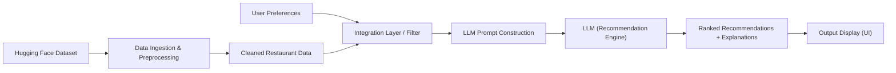

# Context: AI-Powered Restaurant Recommendation System (Zomato Use Case)

## 1. Problem Overview

The goal of this project is to build an **AI-powered restaurant recommendation service** inspired by Zomato. The system intelligently suggests restaurants to users by combining **structured restaurant data** with a **Large Language Model (LLM)** to produce personalized, human-like recommendations.

---

## 2. Objective

Design and implement an application that:

1. **Takes user preferences** — location, budget, cuisine type, minimum rating, and additional preferences (e.g., family-friendly, quick service).
2. **Uses a real-world dataset** — the Zomato restaurant dataset hosted on Hugging Face.
3. **Leverages an LLM** — to generate personalized, natural-language recommendations that go beyond simple filtering.
4. **Displays clear and useful results** — in a user-friendly format with explanations.

---

## 3. Dataset

| Property | Details |
|----------|---------|
| **Source** | Hugging Face — [ManikaSaini/zomato-restaurant-recommendation](https://huggingface.co/datasets/ManikaSaini/zomato-restaurant-recommendation) |
| **Type** | Structured tabular data |
| **Key Fields** | Restaurant name, location, cuisine, cost, rating, and other metadata |

---

## 4. System Workflow

The application follows a **5-stage pipeline**:

### Stage 1 — Data Ingestion

- Load and preprocess the Zomato dataset from the Hugging Face Hub.
- Extract and clean relevant fields:
  - Restaurant name
  - Location / city
  - Cuisine type(s)
  - Cost for two / price range
  - Aggregate rating
  - Any additional metadata available in the dataset

### Stage 2 — User Input Collection

Collect the following preferences from the user:

| Preference | Example Values | Required |
|------------|---------------|----------|
| **Location** | Delhi, Bangalore, Mumbai | Yes |
| **Budget** | Low, Medium, High | Yes |
| **Cuisine** | Italian, Chinese, North Indian | Yes |
| **Minimum Rating** | 3.5, 4.0, 4.5 | Yes |
| **Additional Preferences** | Family-friendly, quick service, rooftop, etc. | Optional |

### Stage 3 — Integration Layer

This is the bridge between raw data and the LLM:

1. **Filter** the restaurant dataset based on the user's stated preferences (location, budget, cuisine, rating).
2. **Prepare structured results** — format the filtered restaurants into a structured representation suitable for an LLM prompt.
3. **Prompt engineering** — design a prompt that instructs the LLM to reason about and rank the filtered options, considering all user preferences including the optional/additional ones.

### Stage 4 — Recommendation Engine (LLM)

Use the LLM to:

- **Rank** the filtered restaurants from best-fit to least-fit based on the user's preferences.
- **Provide explanations** — for each recommended restaurant, explain *why* it is a good match for the user.
- **Optionally summarize** — give a brief overall summary of the top choices.

### Stage 5 — Output Display

Present the top recommendations in a clear, user-friendly format. Each recommendation should include:

| Output Field | Description |
|-------------|-------------|
| **Restaurant Name** | Name of the recommended restaurant |
| **Cuisine** | Cuisine type(s) served |
| **Rating** | Aggregate rating from the dataset |
| **Estimated Cost** | Approximate cost (for two) or budget tier |
| **AI-Generated Explanation** | A natural-language explanation of why this restaurant was recommended |

---

## 5. Architecture Diagram

---

## 6. Key Technical Considerations

| Area | Details |
|------|---------|
| **Data source** | Hugging Face `datasets` library for loading; pandas for preprocessing |
| **Filtering logic** | Rule-based filtering on location, budget, cuisine, and rating before LLM invocation |
| **LLM integration** | API-based call to an LLM (e.g., OpenAI GPT, Google Gemini, or open-source alternatives) |
| **Prompt design** | Must include filtered restaurant data + user preferences; instruct the model to rank and explain |
| **Output format** | Structured display — could be CLI-based, web-based, or notebook-based depending on implementation choice |

---

## 7. Success Criteria

- [ ] Dataset is loaded and preprocessed correctly from Hugging Face
- [ ] User preferences are collected (at minimum: location, budget, cuisine, rating)
- [ ] Restaurants are filtered based on user input before being sent to the LLM
- [ ] LLM generates ranked, explained recommendations
- [ ] Results are displayed in a clear, user-friendly format
- [ ] The system handles edge cases (e.g., no matching restaurants, invalid input)

---

## 8. Source Reference

This context is derived from the project problem statement:  
[problemStatement.txt](file:///d:/NEXTLEAP%20GEN%20AI/Zomato%20recommendation%20system/docs/problemStatement.txt)
